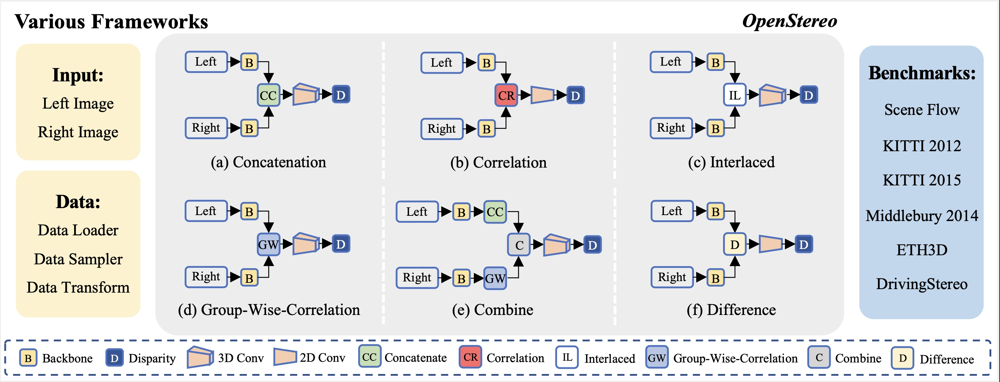

------------------------------------------
OpenStereo is a flexible and extensible project for stereo matching.

## What's New
- **[January 2024]**: Our proposed StereoBase rank 1st on the [KITTI15 leaderboard](https://www.cvlibs.net/datasets/kitti/eval_scene_flow_detail.php?benchmark=stereo&result=52177cbd800e317dc999650fae31408deccebb4d])!!!
- **[December 2023]**: Our paper makes public: [OpenStereo: A Comprehensive Benchmark for Stereo Matching and Strong Baseline](https://arxiv.org/abs/2312.00343)
- **[March 2023]**:OpenStereo is available!!!

## Highlighted features
- **Mutiple Dataset supported**: OpenStereo supports six popular stereo datasets: [SceneFlow](datasets/SceneFlow/README.md), [KITTI12](datasets/KITTI12/README.md) & [KITTI15](datasets/KITTI15/README.md), 
 [ETH3D](datasets/ETH3D/README.md),[Middlebury](datasets/Middlebury/README.md) and [DrivingStereo](datasets/DrivingStereo/README.md) .
- **Multiple Models Support**: We reproduced several SOTA methods, and reached the same or even the better performance. 
- **DDP Support**: The officially recommended [`Distributed Data Parallel (DDP)`](https://pytorch.org/tutorials/intermediate/ddp_tutorial.html) mode is used during both the training and testing phases.
- **AMP Support**: The [`Auto Mixed Precision (AMP)`](https://pytorch.org/tutorials/recipes/recipes/amp_recipe.html?highlight=amp) option is available.
- **Nice log**: We use [`tensorboard`](https://pytorch.org/docs/stable/tensorboard.html) and `logging` to log everything, which looks pretty.


## Getting Started

Please see [0.get_started.md](docs/0.get_started.md). We also provide the following tutorials for your reference:
- [Prepare dataset](docs/2.prepare_dataset.md)
- [Detailed configuration](docs/3.detailed_config.md)
- [Customize model](docs/4.how_to_create_your_model.md)
- [Advanced usages](docs/5.advanced_usages.md) 

## Model Zoo
Results and models are available in the [model zoo](docs/1.model_zoo.md).


## Acknowledgement
[AANet](https://github.com/haofeixu/aanet) &nbsp; [ACVNet](https://github.com/gangweiX/ACVNet) &nbsp; [CascadeStereo](https://github.com/alibaba/cascade-stereo) &nbsp; [CFNet](https://github.com/gallenszl/CFNet) &nbsp; [COEX](https://github.com/antabangun/coex) &nbsp; [DenseMatching](https://github.com/DeepMotionAIResearch/DenseMatchingBenchmark) &nbsp; [FADNet++](https://github.com/HKBU-HPML/FADNet/tree/fadnet-pp) &nbsp; [GwcNet](https://github.com/xy-guo/GwcNet) &nbsp; [MSNet](https://github.com/cogsys-tuebingen/mobilestereonet) &nbsp; [PSMNet](https://github.com/JiaRenChang/PSMNet) &nbsp; [RAFT](https://github.com/princeton-vl/RAFT-Stereo) &nbsp; [STTR](https://github.com/mli0603/stereo-transformer) &nbsp; [OpenGait](https://github.com/ShiqiYu/OpenGait) &nbsp; [IGEV](https://github.com/gangweiX/IGEV/tree/main/IGEV-Stereo)

## Citation
```
@article{OpenStereo,
        title={OpenStereo: A Comprehensive Benchmark for Stereo Matching and Strong Baseline},
        author={Guo, Xianda and Lu, Juntao and Zhang, Chenming and Wang, Yiqi and Duan, Yiqun and Yang, Tian and Zhu, Zheng and Chen, Long},
        journal={arXiv preprint arXiv:2312.00343},
        year={2023}
}
```
**Note**: This code is only used for academic purposes, people cannot use this code for anything that might be considered commercial use.
