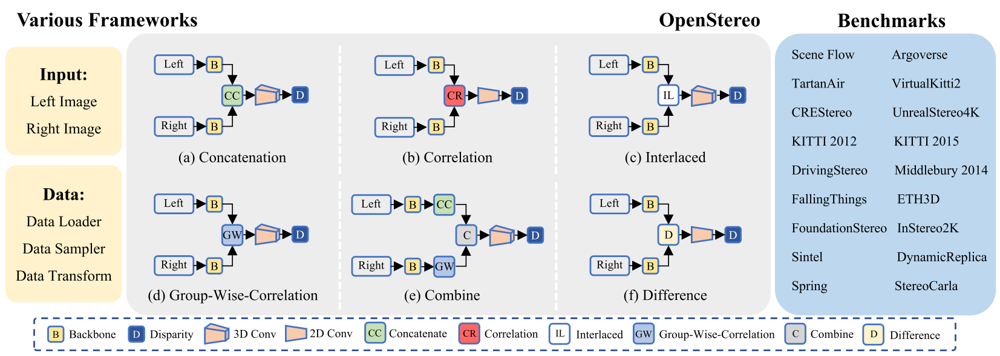

<div align="center">
<!-- PROJECT LOGO -->
<h1 align="center">OpenStereo: A Comprehensive Benchmark for Stereo Matching</h1>
<a href="https://arxiv.org/abs/2312.00343"></a> 
</div>


OpenStereo is a flexible and extensible project for stereo matching.

## What's New
- **[June 12, 2025]**: We have integrated the [FoundationStereo](https://arxiv.org/abs/2501.09898) model (training and inference).
- **[Jan 28th, 2025]**: The paper of LightStereo has been accepted by ICRA 2025.
- **[Nov 22nd, 2024]**: The paper of StereoAnything makes public: [Stereo Anything: Unifying Stereo Matching with Large-Scale Mixed Data](https://arxiv.org/abs/2411.14053).
- **[July 1st, 2024]**: The paper of LightStereo makes public: [LightStereo: Channel Boost Is All You Need for Efficient 2D Cost Aggregation](https://arxiv.org/abs/2406.19833).
- **[June 26th, 2024]**: TensorRT has been integrated, please see the [Deployment documentation](deploy/README.md).
- **[May 2024]**: The 2.0 version of OpenStereo is available, featuring an optimized training and testing framework.
- **[January 2024]**: Our proposed StereoBase rank 1st on the [KITTI15 leaderboard](https://www.cvlibs.net/datasets/kitti/eval_scene_flow.php?benchmark=stereo)!!!
- **[December 2023]**: Our paper makes public: [OpenStereo: A Comprehensive Benchmark for Stereo Matching and Strong Baseline](https://arxiv.org/abs/2312.00343).
- **[March 2023]**:OpenStereo is available!!!

## Our Publications
- **[ICRA25]** LightStereo: Channel Boost Is All Your Need for Efficient 2D Cost Aggregation, [*Paper*](https://arxiv.org/abs/2406.19833) and [*Code*](stereo/modeling/models/lightstereo).
- **[Arxiv'24]** Stereo Anything: Unifying Stereo Matching with Large-Scale Mixed Data, [*Paper*](https://arxiv.org/abs/2411.14053) and [*ProjectPage*](https://xiandaguo.net/StereoAnything/)
- **[Arxiv'23]** OpenStereo: A Comprehensive Benchmark for Stereo Matching and Strong Baseline,  [*Paper*](https://arxiv.org/abs/2312.00343) and [*Code*](cfgs/).

## Overall

  
## Highlighted features
- **Multiple Dataset supported**: OpenStereo supports 15 popular stereo datasets: [SceneFlow](data/SceneFlow/README.md), [KITTI12](data/KITTI12/README.md) & [KITTI15](data/KITTI15/README.md), 
 [ETH3D](data/ETH3D/README.md), [Middlebury](data/Middlebury/README.md), [DrivingStereo](data/DrivingStereo/README.md), [Sintel](data/Sintel/README.md), [FallingThings](data/FallingThings/README.md), [InStereo2K](data/InStereo2K/README.md),[UnrealStereo4k](data/UnrealStereo4k/README.md), [VirtualKitti2](data/VirtualKitti2/README.md), [CREStereo](data/CREStereo/README.md), [Argoverse](data/Argoverse/README.md), [Spring](data/Spring/README.md), and [TartanAir](data/TartanAir/README.md).
- **Multiple Models Support**: We reproduced several SOTA methods and achieved the same or even better performance. 
- **DDP Support**: The officially recommended [`Distributed Data Parallel (DDP)`](https://pytorch.org/tutorials/intermediate/ddp_tutorial.html) mode is used during both the training and testing phases.
- **AMP Support**: The [`Auto Mixed Precision (AMP)`](https://pytorch.org/tutorials/recipes/recipes/amp_recipe.html?highlight=amp) option is available.
- **TensorRT Support**: TensorRT has been integrated.
- **Nice log**: We use [`tensorboard`](https://pytorch.org/docs/stable/tensorboard.html) and `logging` to log everything, which looks pretty.


## Getting Started

Please see [0.get_started.md](docs/0.get_started.md). We also provide the following tutorials for your reference:
- [Prepare dataset](docs/2.prepare_dataset.md)
- [Detailed configuration](docs/3.detailed_config.md)
- [Customize model](docs/4.how_to_create_your_model.md)
- [Advanced usages](docs/5.advanced_usages.md) 

## Model Zoo
Results and models are available in the [model zoo](docs/1.model_zoo.md).


## Acknowledgement
[AANet](https://github.com/haofeixu/aanet) &nbsp; [ACVNet](https://github.com/gangweiX/ACVNet) &nbsp; [CascadeStereo](https://github.com/alibaba/cascade-stereo) &nbsp; [CFNet](https://github.com/gallenszl/CFNet) &nbsp; [COEX](https://github.com/antabangun/coex) &nbsp; [DenseMatching](https://github.com/DeepMotionAIResearch/DenseMatchingBenchmark) &nbsp; [FADNet++](https://github.com/HKBU-HPML/FADNet/tree/fadnet-pp) &nbsp; [GwcNet](https://github.com/xy-guo/GwcNet) &nbsp; [MSNet](https://github.com/cogsys-tuebingen/mobilestereonet) &nbsp; [PSMNet](https://github.com/JiaRenChang/PSMNet) &nbsp; [RAFT](https://github.com/princeton-vl/RAFT-Stereo) &nbsp; [STTR](https://github.com/mli0603/stereo-transformer) &nbsp; [OpenGait](https://github.com/ShiqiYu/OpenGait) &nbsp; [IGEV](https://github.com/gangweiX/IGEV/tree/main/IGEV-Stereo) &nbsp; [NMRF](https://github.com/aeolusguan/NMRF) &nbsp;

## Citation
```
@article{OpenStereo,
        title={OpenStereo: A Comprehensive Benchmark for Stereo Matching and Strong Baseline},
        author={Guo, Xianda and Zhang, Chenming and Lu, Juntao  and Wang, Yiqi and Duan, Yiqun and Yang, Tian and Zhu, Zheng and Chen, Long},
        journal={arXiv preprint arXiv:2312.00343},
        year={2023}
}
@article{guo2024stereo,
  title={Stereo Anything: Unifying Stereo Matching with Large-Scale Mixed Data},
  author={Guo, Xianda and Zhang, Chenming and Zhang, Youmin and Nie, Dujun and Wang, Ruilin and Zheng, Wenzhao and Poggi, Matteo and Chen, Long},
  journal={arXiv preprint arXiv:2411.14053},
  year={2024}
}
@inproceedings{guo2025lightstereo,
  title={Lightstereo: Channel boost is all you need for efficient 2d cost aggregation},
  author={Guo, Xianda and Zhang, Chenming and Nie, Dujun and Zheng, Wenzhao and Zhang, Youmin and Chen, Long},
  booktitle={ICRA},
  year={2025}
}
```
